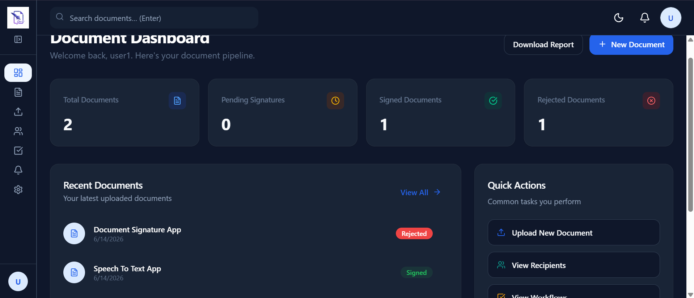
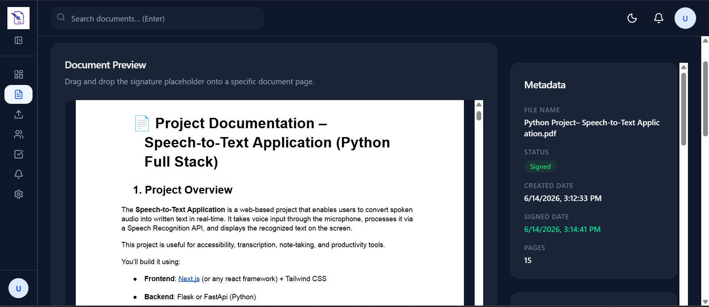
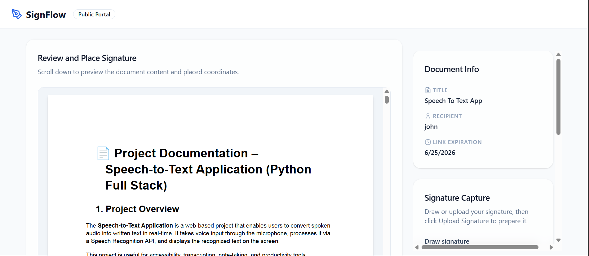
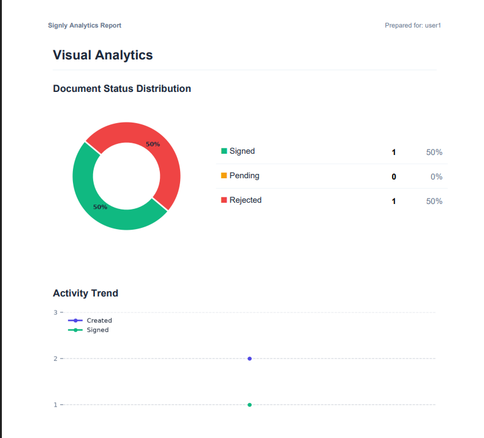
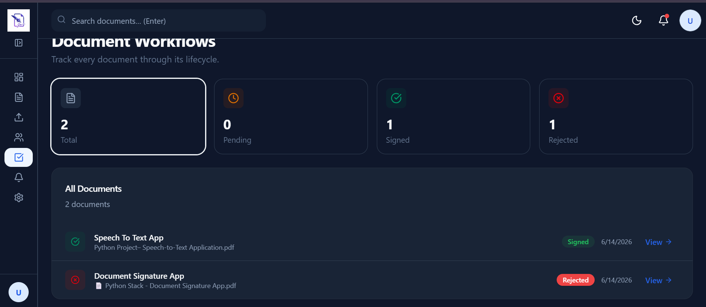
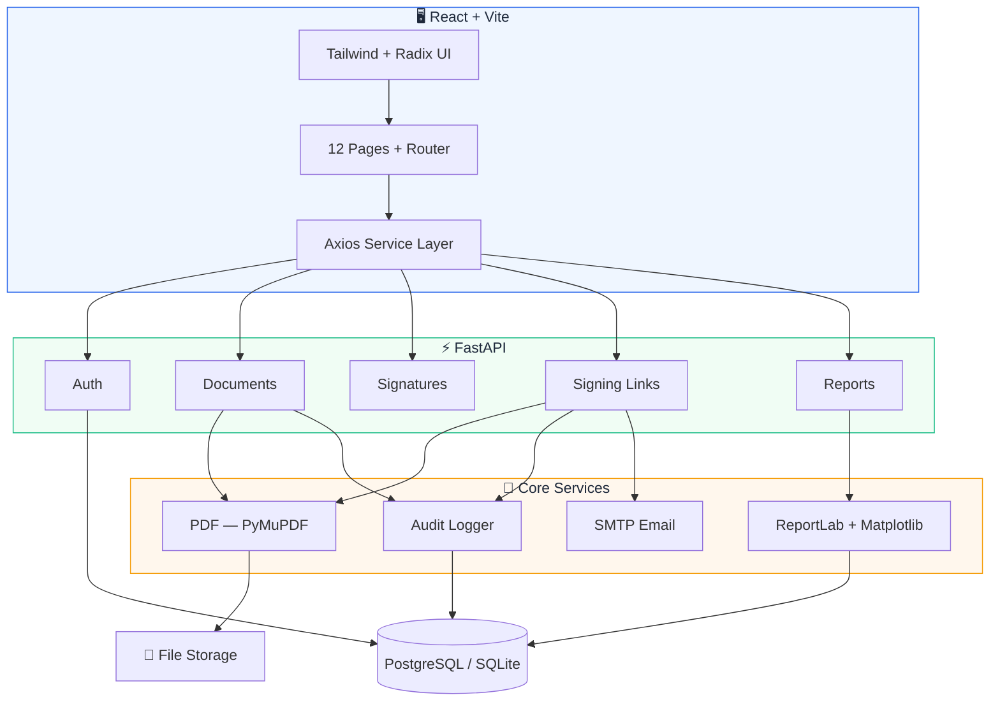

<div align="center">

# ✦ Signly

### Secure Digital Document Signing Platform

**Upload → Place → Sign → Done.**
An end-to-end signature workflow with public signing links, audit trails, and analytics — built in 10 days.

<br/>

[](https://react.dev)
[](https://fastapi.tiangolo.com)
[](https://postgresql.org)
[](https://tailwindcss.com)
[](https://jwt.io)
[](https://pymupdf.readthedocs.io)
[](LICENSE)

<br/>

<!-- 🔽 HERO IMAGE — Replace with your best dashboard screenshot -->


<br/>

[Live Demo](#) · [API Docs](#) · [Report Bug](https://github.com/dhyey2402/signly/issues)

</div>

---

<br/>

## 📊 Project Stats

<div align="center">

| 25+ API Endpoints | 12 React Pages | 8 Database Models | 5 Core Services |
|:-:|:-:|:-:|:-:|
| Full REST API | SPA with protected routes | SQLAlchemy ORM | PDF, Auth, Audit, Email, Reports |

| 10-Day Build | JWT Auth | PDF Processing | Responsive UI |
|:-:|:-:|:-:|:-:|
| Solo full-stack project | bcrypt + token expiry | PyMuPDF + ReportLab | Dark mode + mobile-first |

</div>

<br/>

---

<br/>

## 🎬 Demo

<!-- 🔽 Replace with a real GIF showing: Upload → Place Signature → Generate Link → Sign → Download -->
<!-- Record with OBS/LICEcap, optimize with ezgif.com, keep under 15 seconds -->


> **Upload a PDF → Drag signature fields → Generate a public link → Recipient signs → Signed PDF ready**

<br/>

---

<br/>

## ⚡ Features

<table>
<tr>
<td width="50%">

### 🔐 Authentication
JWT login/register · bcrypt hashing · protected routes · ownership enforcement

</td>
<td width="50%">

### 📄 Document Management
PDF upload with validation · status tracking · download original & signed PDFs

</td>
</tr>
<tr>
<td width="50%">

### ✍️ Digital Signatures
Drag-and-drop field placement · multi-page support · signature image upload · PyMuPDF stamping

</td>
<td width="50%">

### 🔗 Public Signing Links
Tokenized URLs · no account required · 7-day auto-expiry · branded email notifications

</td>
</tr>
<tr>
<td width="50%">

### 📋 Audit Trail
Full lifecycle logging · IP address capture · rejection tracking · chronological history

</td>
<td width="50%">

### 📈 Analytics Reports
Dashboard KPIs · downloadable PDF reports · pie/line/funnel charts · recipient metrics

</td>
</tr>
</table>

<br/>

---

<br/>

## 🖥️ Screenshots

<div align="center">

| Document Detail | Public Signing |
|:-:|:-:|
|  |  |

| Analytics Report | Workflow View |
|:-:|:-:|
|  |  |

</div>

<br/>

---

<br/>

## 🧠 Engineering Challenges

<table>
<tr>
<td width="33%">

#### 📐 PDF Signature Placement
- Stored coordinates as **relative values** (0–1 range)
- Supported arbitrary PDF page dimensions
- Converted browser pixel coordinates → PDF point space using PyMuPDF
- Maintained placement accuracy across different PDF sizes

</td>
<td width="33%">

#### 🔗 Public Signing Workflow
- Designed **tokenized links** with UUID v4
- Implemented 7-day expiration with timezone-aware checks
- Prevented duplicate signing with status guards
- Built full public flow — no recipient account needed

</td>
<td width="33%">

#### 📋 Audit Trail Architecture
- Captured every lifecycle event: upload → view → sign → reject → download
- Recorded timestamp, IP address, and actor for each action
- Linked audit entries to documents, users, and signing links
- Powered notification feed from audit data

</td>
</tr>
</table>

<br/>

---

<br/>

## 🏗️ Architecture



<br/>

---

<br/>

## 🔄 Signing Workflow

```mermaid
graph LR
    A["📤 Upload PDF"] --> B["📍 Place Fields"]
    B --> C["🔗 Generate Link"]
    C --> D["📧 Email Sent"]
    D --> E["✍️ Recipient Signs"]
    E --> F["📄 Signed PDF"]
    F --> G["📋 Audit Logged"]

    style A fill:#EFF6FF,stroke:#2563EB,color:#1E293B
    style B fill:#EFF6FF,stroke:#2563EB,color:#1E293B
    style C fill:#FFF7ED,stroke:#F59E0B,color:#1E293B
    style D fill:#FFF7ED,stroke:#F59E0B,color:#1E293B
    style E fill:#F0FDF4,stroke:#10B981,color:#1E293B
    style F fill:#F0FDF4,stroke:#10B981,color:#1E293B
    style G fill:#F5F3FF,stroke:#7C3AED,color:#1E293B
```



<br/>

---

<br/>

## 🛠️ Tech Stack

<table>
<tr>
<th align="left" width="140">Layer</th>
<th align="left">Technology</th>
</tr>
<tr><td><strong>Frontend</strong></td><td>React 19 · Vite 8 · Tailwind CSS 4 · Framer Motion · React Router 7 · React-PDF · Radix UI · Lucide Icons</td></tr>
<tr><td><strong>Backend</strong></td><td>FastAPI · SQLAlchemy 2.0 · Pydantic 2 · Uvicorn</td></tr>
<tr><td><strong>Database</strong></td><td>PostgreSQL (prod) / SQLite (dev)</td></tr>
<tr><td><strong>Auth</strong></td><td>python-jose (JWT) · bcrypt via Passlib</td></tr>
<tr><td><strong>PDF Engine</strong></td><td>PyMuPDF (signature stamping) · ReportLab + Matplotlib (analytics reports)</td></tr>
<tr><td><strong>Email</strong></td><td>SMTP with branded HTML templates</td></tr>
</table>

<br/>

---

<br/>

## 🔒 Security

| Feature | Implementation |
|:--------|:---------------|
| Password Hashing | bcrypt via Passlib with auto-upgrade |
| JWT Auth | HS256 tokens · 30-minute expiry |
| Route Protection | `HTTPBearer` dependency on all authenticated endpoints |
| Ownership Checks | Every query filtered by `uploaded_by == current_user.id` |
| Signing Links | UUID v4 tokens · 7-day expiration · single-use enforcement |
| CORS | Whitelisted origins only |
| File Validation | PDF-only uploads · image type whitelisting for signatures |
| IP Logging | Client IP recorded on every audit event |

<br/>

---

<br/>

## 🚀 Quick Start

### Backend

```bash
cd backend
python -m venv venv && venv\Scripts\activate   # Windows
pip install -r requirements.txt
```

Create `backend/.env`:

```env
DATABASE_URL=sqlite:///./signature_app.db
SECRET_KEY=your-secret-key
ALGORITHM=HS256
```

```bash
uvicorn app.main:app --reload     # → http://localhost:8000
```

### Frontend

```bash
cd frontend
npm install
npm run dev                       # → http://localhost:5173
```

<br/>

---

<br/>

## 📁 Project Structure

```
signly/
├── backend/
│   ├── app/
│   │   ├── core/             # Config, database, security
│   │   ├── models/           # User, Document, Signature, AuditLog, SigningLink
│   │   ├── routers/          # auth, documents, signatures, signing_links, reports
│   │   ├── schemas/          # Pydantic validation schemas
│   │   ├── services/         # auth, pdf, audit, email, report services
│   │   ├── utils/            # JWT & password helpers
│   │   └── main.py           # App entry point
│   └── uploads/              # documents/, signatures/, signed/
│
├── frontend/
│   └── src/
│       ├── components/       # layout/, signature/, ui/
│       ├── context/          # AuthContext
│       ├── pages/            # 12 pages (Dashboard, DocumentDetail, PublicSign, etc.)
│       └── services/         # API client layer
```

<br/>

---

<br/>

<details>
<summary><strong>🌐 API Reference (25+ endpoints)</strong></summary>

<br/>

| Method | Endpoint | Description |
|:------:|:---------|:------------|
| `POST` | `/api/auth/register` | Create account |
| `POST` | `/api/auth/login` | Get JWT token |
| `GET` | `/api/auth/me` | Current user profile |
| `POST` | `/api/documents/upload` | Upload PDF |
| `GET` | `/api/documents/` | List documents |
| `GET` | `/api/documents/{id}` | Document detail |
| `DELETE` | `/api/documents/{id}` | Delete document |
| `GET` | `/api/documents/{id}/download` | Download original PDF |
| `GET` | `/api/documents/{id}/audit` | Audit trail |
| `POST` | `/api/documents/{id}/reject` | Reject with reason |
| `POST` | `/api/documents/{id}/sign` | Sign document |
| `GET` | `/api/documents/{id}/signed` | Download signed PDF |
| `GET` | `/api/documents/notifications` | Notification feed |
| `POST` | `/api/signatures/` | Place signature field |
| `GET` | `/api/signatures/{doc_id}` | Get fields |
| `POST` | `/api/signatures/upload` | Upload signature image |
| `POST` | `/api/signing-links/` | Generate public link |
| `GET` | `/api/signing-links/` | List links |
| `GET` | `/api/signing-links/{token}` | Public link detail |
| `POST` | `/api/signing-links/{token}/sign` | Sign via public link |
| `GET` | `/api/signing-links/{token}/download` | Download via public link |
| `GET` | `/api/signing-links/{token}/download-signed` | Download signed via public link |
| `GET` | `/api/reports/dashboard` | Generate analytics PDF |

</details>

<br/>

---

<br/>

## 🗺️ Roadmap

- 🔲 OAuth (Google & GitHub login)
- 🔲 Multi-signer workflows
- 🔲 Cloud storage (S3 / GCS)
- 🔲 Real-time notifications via WebSocket
- 🔲 Stripe subscription billing

<br/>

---

<br/>

## 🔗 Deployment

| Service | URL |
|:--------|:----|
| 🌐 Live Demo | [Coming Soon](#) |
| ⚡ API Docs | [Coming Soon](#) |
| 📦 Repository | [github.com/dhyey2402/signly](https://github.com/dhyey2402/signly) |

<br/>

---

<br/>

## 📝 License

MIT — see [LICENSE](LICENSE) for details.

<br/>

<div align="center">

**Built with ❤️ by [Dhyey](https://github.com/dhyey2402)**

*If this project helped you, consider giving it a ⭐*

</div>
